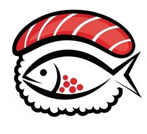

# 🍣 Wokami - Menú Digital

> **El fuego del wok. El alma del sushi.**

Aplicación web progresiva (PWA-ready) para el menú digital del restaurante Wokami Sushi & Wok. Diseñada con enfoque mobile-first, ofrece una experiencia de pedido intuitiva con integración directa a WhatsApp.



## 📋 Características Principales

- ✅ **Diseño Mobile-First** - Optimizado para dispositivos móviles
- ✅ **Carrito de Compras** - Agrega, elimina y gestiona productos
- ✅ **Promociones Automáticas** - Descuentos según el día de la semana
- ✅ **Sistema de Cupones** - WOK5, PREPA10, FAMILIA con validaciones
- ✅ **Barra de Progreso** - Gamificación: ¡Gana Kushiague gratis!
- ✅ **Selección de Proteínas** - Para platos mixtos del Wok
- ✅ **Integración WhatsApp** - Pedidos directos con formato profesional
- ✅ **Estado en Tiempo Real** - Badge de ABIERTO/CERRADO automático

## 🏗️ Estructura del Proyecto

```
wokami-refactor/
│
├── index.html              # Página principal (estructura semántica)
│
├── css/
│   └── styles.css          # Estilos personalizados + utilidades
│
├── js/
│   ├── menu-data.js        # Datos del menú en JSON
│   └── app.js              # Lógica principal de la aplicación
│
├── assets/
│   └── img/                # Imágenes del menú
│       ├── logo.png
│       ├── kushiagues.jpg
│       ├── america.jpg
│       ├── banana.jpg
│       ├── cheese.jpg
│       ├── california.jpg
│       ├── nortenito.jpg
│       ├── diabla.jpg
│       ├── grinch.jpg
│       ├── aguachile.jpg
│       ├── charola.jpg
│       ├── yakimeshi.jpg
│       ├── lomein.jpg
│       ├── galletas.jpg
│       ├── helado.jpg
│       ├── mochis.jpg
│       ├── aguas.jpg
│       └── refrescos.jpg
│
└── README.md               # Este archivo
```

## 🚀 Instalación y Uso Local

### 1. Clonar o descargar el proyecto

```bash
git clone https://github.com/tu-usuario/wokami-menu.git
cd wokami-menu
```

O simplemente descarga el ZIP y extrae los archivos.

### 2. Organizar las imágenes

Coloca todas las imágenes del menú en la carpeta `assets/img/` con los siguientes nombres exactos:

| Archivo | Descripción | Tamaño recomendado |
|---------|-------------|-------------------|
| `logo.png` | Logo de Wokami | 300x300px |
| `kushiagues.jpg` | Kushiagues | 400x400px |
| `america.jpg` | America Roll | 400x300px |
| `banana.jpg` | Banana Roll | 400x300px |
| `cheese.jpg` | Cheese Roll | 400x300px |
| `california.jpg` | California Roll | 400x300px |
| `nortenito.jpg` | Norteñito Roll | 400x300px |
| `diabla.jpg` | A la Diabla Roll | 400x300px |
| `grinch.jpg` | Grinch Roll | 400x300px |
| `aguachile.jpg` | Aguachile Roll | 400x300px |
| `charola.jpg` | Charolas | 1000x400px |
| `yakimeshi.jpg` | Yakimeshi | 600x200px |
| `lomein.jpg` | Lo Mein | 600x200px |
| `galletas.jpg` | Galletas New York | 300x300px |
| `helado.jpg` | Tempura Helado | 300x300px |
| `mochis.jpg` | Mochis | 300x300px |
| `aguas.jpg` | Aguas Frescas | 300x300px |
| `refrescos.jpg` | Refrescos | 300x300px |

> **Nota:** Si una imagen no existe, se mostrará un placeholder automáticamente.

### 3. Abrir en el navegador

Simplemente abre el archivo `index.html` en tu navegador:

```bash
# En macOS
open index.html

# En Windows
start index.html

# En Linux
xdg-open index.html
```

O usa un servidor local para desarrollo:

```bash
# Con Python 3
python -m http.server 8000

# Con Node.js (npx)
npx serve .

# Con PHP
php -S localhost:8000
```

Luego visita: `http://localhost:8000`

## 📤 Despliegue en GitHub Pages

### Paso 1: Crear un repositorio en GitHub

1. Ve a [GitHub](https://github.com) e inicia sesión
2. Haz clic en "New repository"
3. Nombra el repositorio: `wokami-menu` (o el nombre que prefieras)
4. Selecciona "Public"
5. Haz clic en "Create repository"

### Paso 2: Subir los archivos

#### Opción A: Por línea de comandos (Git)

```bash
# Inicializar repositorio
git init

# Agregar todos los archivos
git add .

# Hacer commit
git commit -m "Initial commit: Wokami menu digital"

# Conectar con GitHub (reemplaza TU_USUARIO)
git remote add origin https://github.com/TU_USUARIO/wokami-menu.git

# Subir archivos
git branch -M main
git push -u origin main
```

#### Opción B: Por interfaz web

1. En tu repositorio de GitHub, haz clic en "uploading an existing file"
2. Arrastra todos los archivos y carpetas del proyecto
3. Escribe un mensaje de commit (ej: "Initial commit")
4. Haz clic en "Commit changes"

### Paso 3: Activar GitHub Pages

1. En tu repositorio, ve a **Settings** (pestaña superior)
2. En el menú lateral izquierdo, selecciona **Pages**
3. En "Source", selecciona **Deploy from a branch**
4. En "Branch", selecciona **main** y carpeta **/(root)**
5. Haz clic en **Save**

6. Espera 1-2 minutos y tu sitio estará disponible en:
   ```
   https://TU_USUARIO.github.io/wokami-menu/
   ```

## 🔧 Personalización

### Modificar precios

Edita el archivo `js/menu-data.js` y cambia los valores de `price`:

```javascript
{
  id: 'america-roll',
  name: 'America Roll',
  price: 130,  // <-- Cambia aquí
  // ...
}
```

### Agregar nuevos productos

En `js/menu-data.js`, agrega un nuevo objeto al array correspondiente:

```javascript
rollosClasicos: [
  // ... productos existentes
  {
    id: 'nuevo-rollo',
    name: 'Nuevo Roll',
    price: 140,
    description: {
      inside: 'Ingredientes internos',
      outside: 'Ingredientes externos'
    },
    image: 'nuevo-rollo.jpg',
    category: 'rollo',
    hasOptions: true
  }
]
```

### Cambiar número de WhatsApp

En `js/menu-data.js`, modifica:

```javascript
config: {
  phoneNumber: '5214433580280',  // <-- Tu número
  // ...
}
```

### Modificar cupones

En `js/menu-data.js`, edita la sección `cupones`:

```javascript
cupones: {
  WOK5: { 
    discount: 0.05,  // 5%
    description: '5% de descuento' 
  },
  TUCUPON: { 
    discount: 0.15,  // 15%
    description: '15% de descuento',
    validDays: [3, 4, 5] // Miércoles a Viernes
  }
}
```

### Cambiar meta de Kushiague gratis

En `js/menu-data.js`:

```javascript
config: {
  kushiagueGoal: 400,  // Meta en pesos
  // ...
}
```

## 📱 Promociones Automáticas

El sistema aplica descuentos automáticamente según el día:

| Día | Promoción | Lógica |
|-----|-----------|--------|
| Miércoles | Wok & Drink | $15 off por combo Wok + Agua Fresca |
| Jueves | Wok & Drink | $15 off por combo Wok + Agua Fresca |
| Viernes | Viernes Premium | Rollos especiales a $125 (desc. $25) |
| Sábado | Finde Familiar | $50 off en compras > $450 |
| Domingo | Finde Familiar | $50 off en compras > $450 |

## 🎫 Cupones Disponibles

| Cupón | Descuento | Restricciones |
|-------|-----------|---------------|
| `WOK5` | 5% | Sin restricciones |
| `PREPA10` | 10% | Solo Miércoles-Viernes. Auto-dirección a Prepa |
| `FAMILIA` | 10% | Solo Domingos |

> Los cupones **no son acumulables** con promociones automáticas.

## 🎨 Guía de Estilos

### Colores de la marca

```css
--wokami-red: #D80000;      /* Rojo principal */
--wokami-red-dark: #b91c1c; /* Rojo hover */
--wokami-dark: #111111;     /* Fondo oscuro */
--wokami-gray: #f3f4f6;     /* Fondo claro */
```

### Tipografía

- **Títulos:** Cinzel (serif)
- **Cuerpo:** Noto Sans JP (sans-serif)

### Breakpoints

- **Mobile:** < 768px
- **Tablet:** 768px - 1023px
- **Desktop:** ≥ 1024px

## 🛠️ Tecnologías Utilizadas

- **HTML5** - Estructura semántica
- **CSS3** - Estilos con variables CSS
- **Tailwind CSS** - Framework CSS (CDN)
- **JavaScript (Vanilla)** - Lógica de la aplicación
- **Font Awesome** - Iconografía
- **Google Fonts** - Tipografía

## 📝 Notas de Desarrollo

### Convenciones de código

- **Mobile-first:** Todos los estilos base son para móvil
- **BEM-like:** Clases descriptivas (`.menu-item-card`, `.btn-primary`)
- **Accesibilidad:** Atributos ARIA en elementos interactivos
- **Lazy loading:** Imágenes cargan bajo demanda

### Estructura de datos del carrito

```javascript
{
  name: "Cheese Roll (Empanizado)",
  price: 120,
  category: "rollo",
  id: "unique-id-123"
}
```

### Eventos importantes

| Evento | Descripción |
|--------|-------------|
| `addToCart()` | Agrega producto al carrito |
| `removeFromCart()` | Elimina producto por índice |
| `calculateCart()` | Calcula subtotal y descuentos |
| `applyCoupon()` | Valida y aplica cupón |
| `submitOrderWithPreferences()` | Genera mensaje de WhatsApp |

## 🐛 Solución de Problemas

### Las imágenes no cargan

1. Verifica que las imágenes estén en `assets/img/`
2. Comprueba los nombres de archivo (sensibles a mayúsculas)
3. Asegúrate de que las extensiones sean correctas (.jpg, .png)

### El carrito no funciona

1. Abre la consola del navegador (F12)
2. Verifica que `menu-data.js` se cargue antes que `app.js`
3. Comprueba errores de JavaScript

### WhatsApp no abre

1. Verifica que el número en `menu-data.js` sea correcto
2. El formato debe ser: `5214433580280` (código de país + número)
3. Asegúrate de tener WhatsApp Web/APP instalado

## 📄 Licencia

Este proyecto es propiedad de **Wokami Sushi**. Todos los derechos reservados.

## 👨‍💻 Desarrollado por

**Wokami Sushi** - La Barca, Jalisco, México

---

¿Preguntas o sugerencias? Contáctanos por WhatsApp: [+52 1 443 358 0280](https://wa.me/5214433580280)

🍣 **¡Buen provecho!** 🍣
